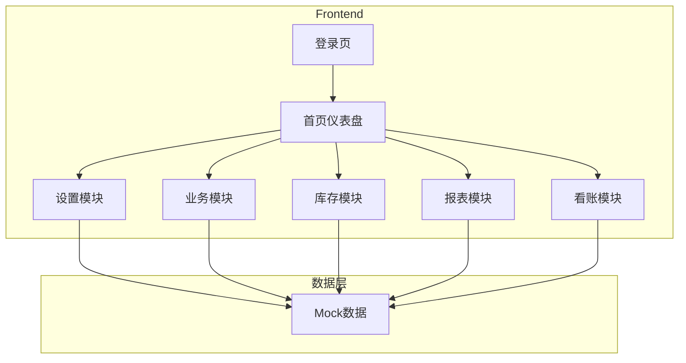

# 财务SaaS软件 1.0版本原型 - 技术架构文档

***

## 1. Architecture Design



***

## 2. Technology Description

| Layer              | Technology       | Version |
| ------------------ | ---------------- | ------- |
| Frontend Framework | React            | 18.x    |
| Language           | TypeScript       | 5.x     |
| Build Tool         | Vite             | 6.x     |
| CSS Framework      | TailwindCSS      | 3.x     |
| Router             | React Router DOM | 6.x     |
| Icons              | Lucide React     | 0.x     |
| State Management   | Zustand          | 4.x     |

***

## 3. Route Definitions

| Route                        | Purpose | Component               |
| ---------------------------- | ------- | ----------------------- |
| `/`                          | 登录页     | Login                   |
| `/dashboard`                 | 首页仪表盘   | Dashboard               |
| `/settings/company`          | 公司管理    | SettingsCompany         |
| `/settings/employees`        | 员工管理    | SettingsEmployees       |
| `/settings/contacts`         | 往来单位管理  | SettingsContacts        |
| `/settings/categories`       | 收支类别管理  | SettingsCategories      |
| `/settings/subjects`         | 科目管理    | SettingsSubjects        |
| `/settings/accounts`         | 账户管理    | SettingsAccounts        |
| `/settings/projects`         | 项目管理    | SettingsProjects        |
| `/settings/departments`      | 部门管理    | SettingsDepartments     |
| `/settings/roles`            | 角色管理    | SettingsRoles           |
| `/settings/currencies`       | 币种管理    | SettingsCurrencies      |
| `/settings/ledgers`          | 账本管理    | SettingsLedgers         |
| `/settings/logs`             | 业务日志    | SettingsLogs            |
| `/settings/closure`          | 封账管理    | SettingsClosure         |
| `/settings/units`            | 单位管理    | SettingsUnits           |
| `/business/income`           | 收入管理    | BusinessIncome          |
| `/business/expense`          | 费用支出    | BusinessExpense         |
| `/business/receipt`          | 收款管理    | BusinessReceipt         |
| `/business/prepayment`       | 预收预付款   | BusinessPrepayment      |
| `/business/verification`     | 核销      | BusinessVerification    |
| `/business/transfer`         | 往来款转销   | BusinessTransfer        |
| `/business/ap-ar-transfer`   | 应收应付转账  | BusinessApArTransfer    |
| `/business/borrow`           | 借入借出    | BusinessBorrow          |
| `/business/dividend`         | 分红      | BusinessDividend        |
| `/business/equity`           | 股权变更    | BusinessEquity          |
| `/business/fixed-asset`      | 固定资产    | BusinessFixedAsset      |
| `/business/payroll`          | 工资管理    | BusinessPayroll         |
| `/inventory/warehouse`       | 仓库管理    | InventoryWarehouse      |
| `/inventory/product`         | 产品管理    | InventoryProduct        |
| `/inventory/purchase-in`     | 采购入库    | InventoryPurchaseIn     |
| `/inventory/purchase-return` | 采购退货    | InventoryPurchaseReturn |
| `/inventory/sales-out`       | 销售出库    | InventorySalesOut       |
| `/inventory/sales-return`    | 销售退货    | InventorySalesReturn    |
| `/inventory/flow`            | 库存流水    | InventoryFlow           |
| `/inventory/balance`         | 库存余额    | InventoryBalance        |
| `/inventory/cost-adjust`     | 成本调整    | InventoryCostAdjust     |
| `/inventory/assembly`        | 产品组装    | InventoryAssembly       |
| `/inventory/disassembly`     | 产品拆分    | InventoryDisassembly    |
| `/inventory/count`           | 库存盘点    | InventoryCount          |
| `/inventory/profit-in`       | 盘盈入库    | InventoryProfitIn       |
| `/inventory/loss-out`        | 盘亏出库    | InventoryLossOut        |
| `/reports/profit`            | 多维度利润核算 | ReportsProfit           |
| `/reports/financial`         | 财务报表    | ReportsFinancial        |
| `/lookup/biz-summary`        | 业务汇总表   | LookupBizSummary        |
| `/lookup/biz-detail`         | 业务明细汇总表 | LookupBizDetail         |
| `/lookup/voucher`            | 凭证分录表   | LookupVoucher           |
| `/lookup/category-item`      | 收支明细表   | LookupCategoryItem      |
| `/lookup/account-detail`     | 账户明细表   | LookupAccountDetail     |
| `/lookup/subject-balance`    | 科目余额表   | LookupSubjectBalance    |
| `/lookup/trial-balance`      | 试算平衡    | LookupTrialBalance      |

***

## 4. Project Structure

```
src/
├── components/           # 通用组件
│   ├── Layout/          # 布局组件
│   │   ├── Sidebar.tsx
│   │   ├── Header.tsx
│   │   └── Layout.tsx
│   ├── DataTable.tsx     # 数据表格组件
│   ├── Form.tsx          # 表单组件
│   ├── Card.tsx          # 卡片组件
│   └── ...
├── pages/                # 页面组件
│   ├── Login.tsx
│   ├── Dashboard.tsx
│   ├── Settings/         # 设置模块页面
│   ├── Business/         # 业务模块页面
│   ├── Inventory/        # 库存模块页面
│   ├── Reports/          # 报表模块页面
│   └── Lookup/           # 看账模块页面
├── data/                 # Mock数据
│   ├── settings.ts       # 设置模块数据
│   ├── business.ts       # 业务模块数据
│   ├── inventory.ts      # 库存模块数据
│   ├── reports.ts        # 报表数据
│   └── lookup.ts         # 看账数据
├── store/                # Zustand状态管理
│   └── appStore.ts
├── routes/               # 路由配置
│   └── index.tsx
├── utils/                # 工具函数
│   └── index.ts
├── App.tsx
├── main.tsx
└── index.css
```

***

## 5. Data Model (Mock)

### 5.1 用户数据

| 字段       | 类型     | 说明   |
| -------- | ------ | ---- |
| id       | string | 用户ID |
| username | string | 用户名  |
| name     | string | 真实姓名 |
| email    | string | 邮箱   |
| role     | string | 角色   |
| status   | number | 状态   |

### 5.2 公司数据

| 字段      | 类型     | 说明   |
| ------- | ------ | ---- |
| id      | string | 公司ID |
| name    | string | 公司名称 |
| address | string | 地址   |
| phone   | string | 电话   |
| taxNo   | string | 税号   |

### 5.3 往来单位数据

| 字段          | 类型     | 说明             |
| ----------- | ------ | -------------- |
| id          | string | 单位ID           |
| name        | string | 单位名称           |
| type        | number | 类型(1-客户,2-供应商) |
| contactName | string | 联系人            |
| phone       | string | 电话             |
| email       | string | 邮箱             |

### 5.4 业务单据数据

| 字段         | 类型     | 说明   |
| ---------- | ------ | ---- |
| id         | string | 单据ID |
| type       | string | 业务类型 |
| amount     | number | 金额   |
| date       | string | 日期   |
| status     | number | 状态   |
| createTime | string | 创建时间 |

### 5.5 库存数据

| 字段          | 类型     | 说明   |
| ----------- | ------ | ---- |
| id          | string | 库存ID |
| productId   | string | 产品ID |
| warehouseId | string | 仓库ID |
| quantity    | number | 数量   |
| costPrice   | number | 成本价  |

***

## 6. UI Components

### 6.1 Layout Components

| Component | Description      |
| --------- | ---------------- |
| Sidebar   | 左侧导航栏，包含所有模块入口   |
| Header    | 顶部导航栏，包含用户信息、通知等 |
| Layout    | 整体布局容器           |

### 6.2 Data Components

| Component | Description     |
| --------- | --------------- |
| DataTable | 数据表格，支持排序、筛选、分页 |
| FormGroup | 表单组组件           |
| Button    | 按钮组件            |
| Card      | 卡片组件            |
| StatCard  | 统计卡片组件          |

### 6.3 Page Components

| Component   | Description |
| ----------- | ----------- |
| Login       | 登录页面        |
| Dashboard   | 仪表盘首页       |
| Settings\*  | 设置模块各页面     |
| Business\*  | 业务模块各页面     |
| Inventory\* | 库存模块各页面     |
| Reports\*   | 报表模块各页面     |
| Lookup\*    | 看账模块各页面     |

***

## 7. Styling Guidelines

### 7.1 Color Palette

| Color          | Value   | Usage      |
| -------------- | ------- | ---------- |
| Primary        | #1e3a5f | 主色调、导航栏、按钮 |
| Primary Light  | #2d4a6f | hover状态    |
| Success        | #22c55e | 成功状态、绿色按钮  |
| Warning        | #f59e0b | 警告状态       |
| Danger         | #ef4444 | 错误状态、删除按钮  |
| Info           | #3b82f6 | 信息提示       |
| Background     | #f5f7fa | 页面背景       |
| Card           | #ffffff | 卡片背景       |
| Text Primary   | #1f2937 | 主文本        |
| Text Secondary | #6b7280 | 次要文本       |
| Border         | #e5e7eb | 边框颜色       |

### 7.2 Typography

| Element   | Size | Weight |
| --------- | ---- | ------ |
| Heading 1 | 24px | 700    |
| Heading 2 | 20px | 600    |
| Heading 3 | 16px | 600    |
| Body      | 14px | 400    |
| Small     | 12px | 400    |

### 7.3 Spacing

* Base spacing unit: 8px

* Padding: 16px (2 units)

* Margin: 16px (2 units)

* Border-radius: 8px

***

## 8. Responsive Design

### 8.1 Breakpoints

| Device  | Breakpoint     | Layout       |
| ------- | -------------- | ------------ |
| Desktop | > 1280px       | 完整侧边栏 + 主内容区 |
| Tablet  | 768px - 1280px | 可折叠侧边栏       |
| Mobile  | < 768px        | 底部导航 + 侧滑菜单  |

### 8.2 Responsive Components

* Sidebar: 桌面端固定，移动端侧滑

* DataTable: 桌面端完整展示，移动端水平滚动

* Cards: 自适应列数

***

## 9. Development Setup

### 9.1 Environment Setup

```bash
# 初始化项目
pnpm create vite-init@latest . --template react-ts

# 安装依赖
pnpm install

# 安装额外依赖
pnpm install react-router-dom lucide-react zustand tailwindcss @tailwindcss/vite
```

### 9.2 Configuration

* `vite.config.ts`: 配置路径别名、TailwindCSS

* `tsconfig.json`: 配置路径别名

* `tailwind.config.js`: 配置主题颜色

***

## 10. Testing Guidelines

* 使用 Vitest 进行单元测试

* 测试覆盖核心组件和工具函数

* 运行 `pnpm run test` 执行测试

